# Branch index

`master` -> navigation in react apps/react-router basic theory

`react-navigation` -> setting up all the routes of our app

`react-authentication-oauth` -> setting up authentication using google oauth

`forms-with-redux-form` -> submitting forms using redux-form

`rest-based-react-apps` -> doing CRUD operations(fetch,edit,create)(get,post,patch) requests on a rest api

`modals-with-react-portals` -> adding a modal to a react app using react portal and deleting from a rest api

`streaming-video` -> implementing flvjs and node-media-server to implement live streaming feature

# React-Navigation

## Why usign anchor tags is a bad way of navigation

## Router types

## Component Heiarchy

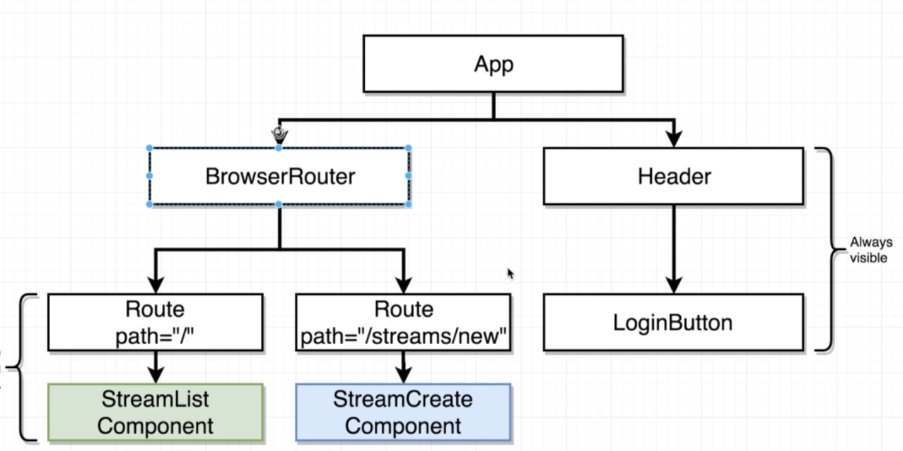

# Oauth authentication

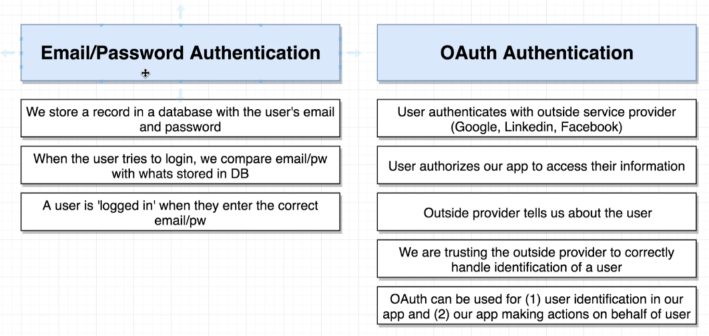

## Oauth flow

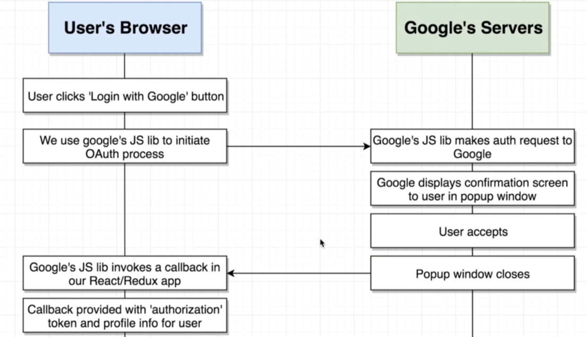

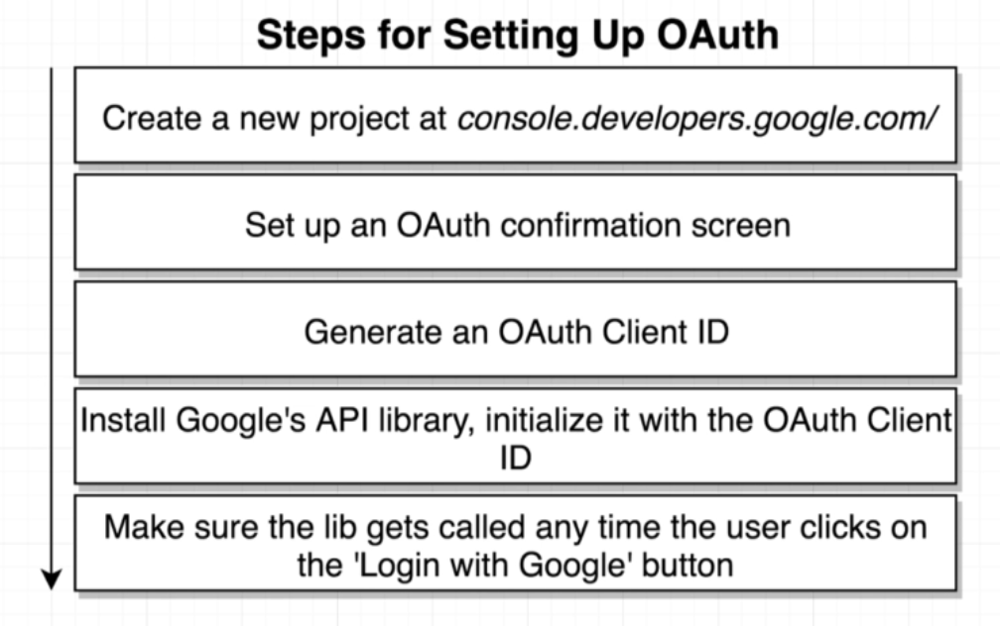

# Redux

## Loosely redux(this is what we are following)

## Completely redux

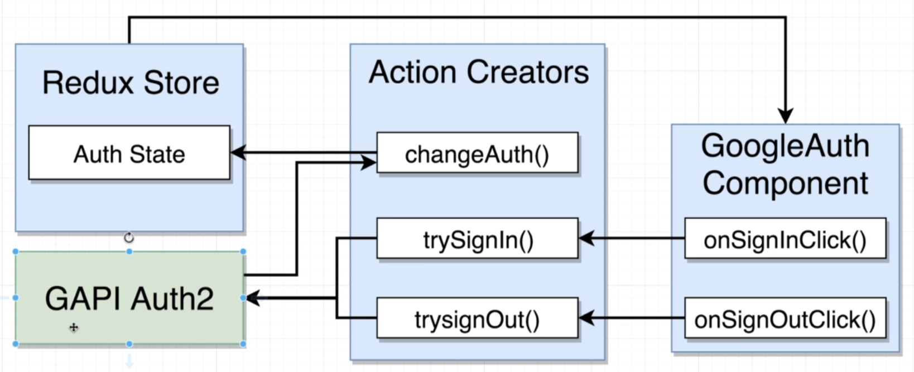

# Redux-form

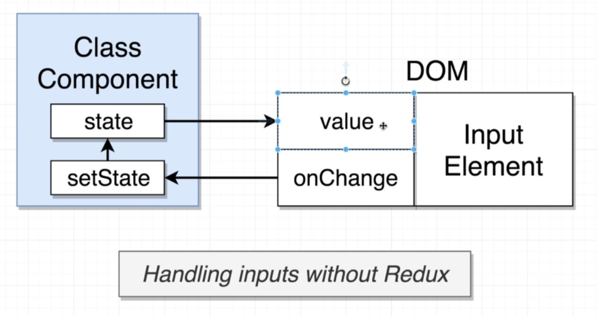
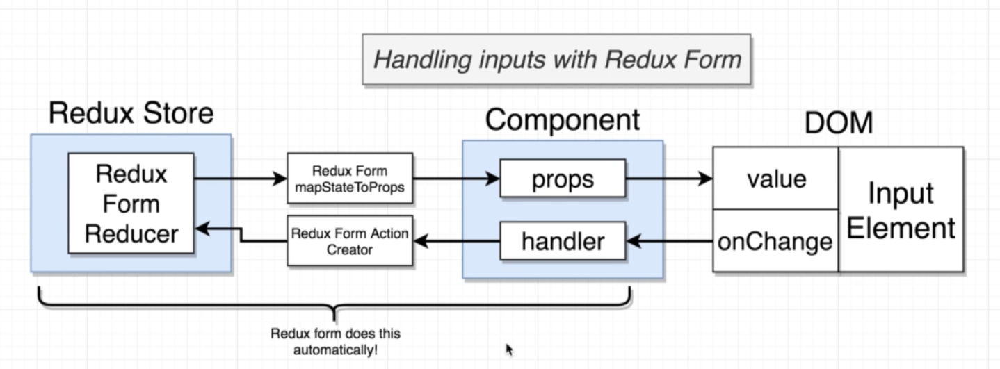

# Rest-full convention

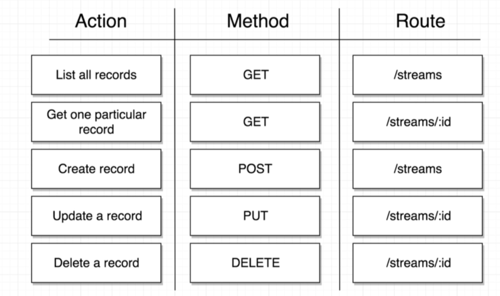

## When to navigate users

we cannot access this history object inside an action creator very easily
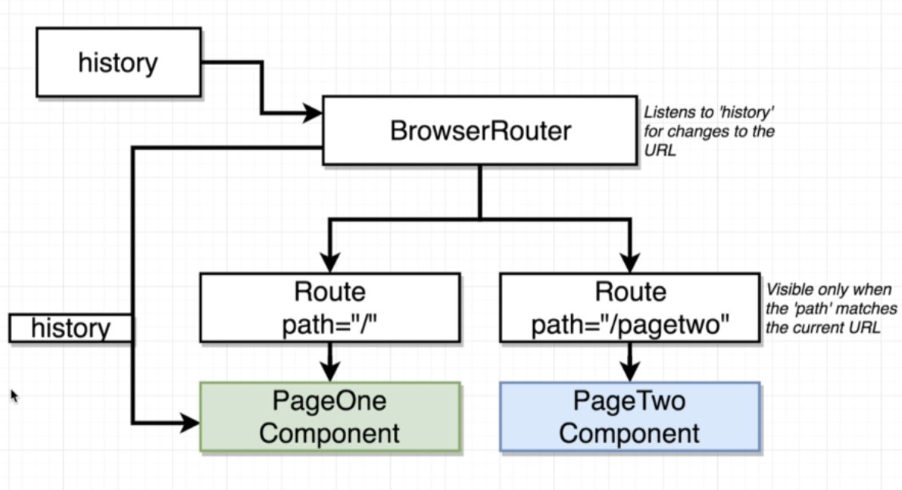

## Programmatic navigation how?

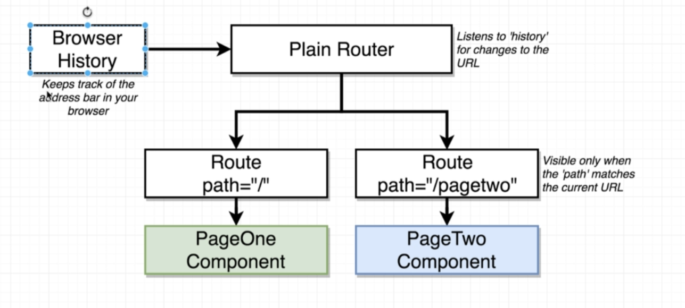

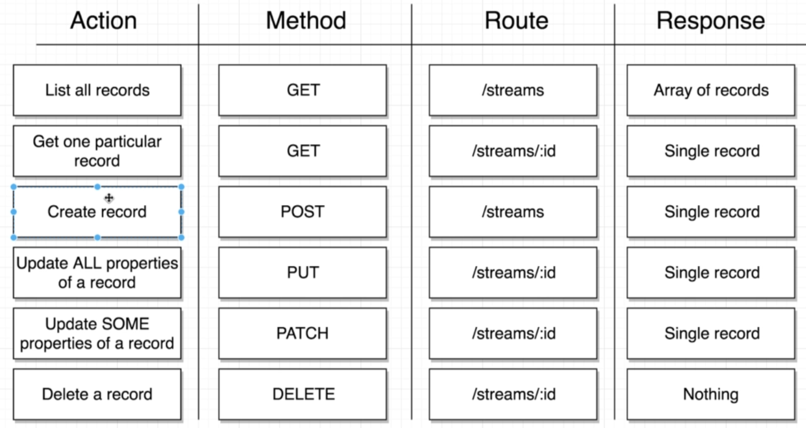
